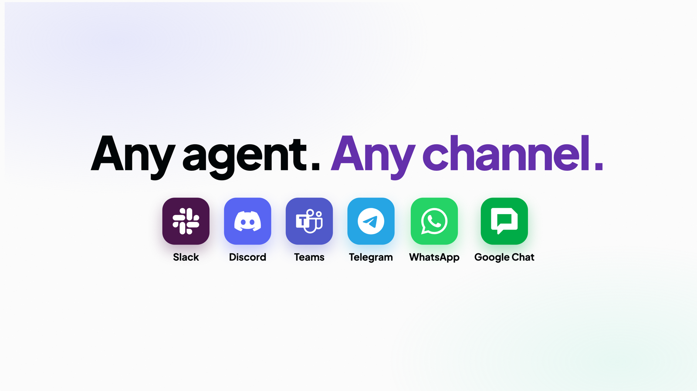
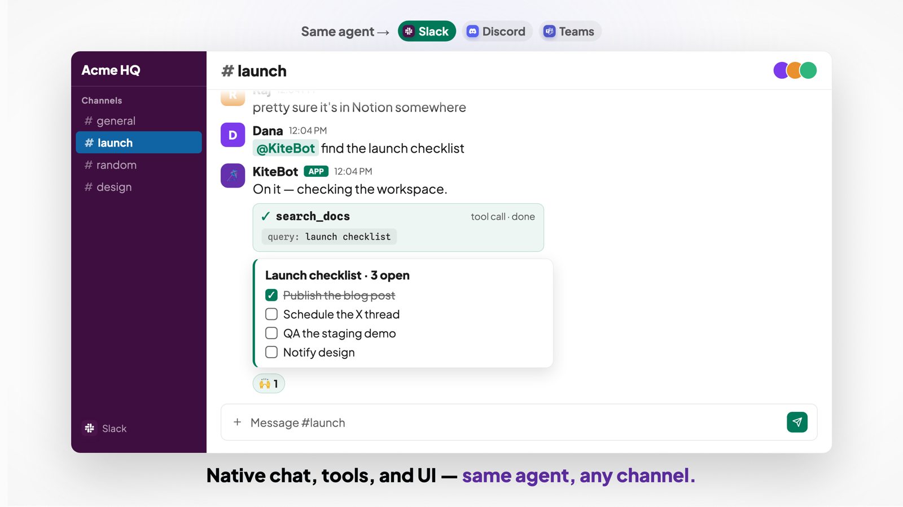
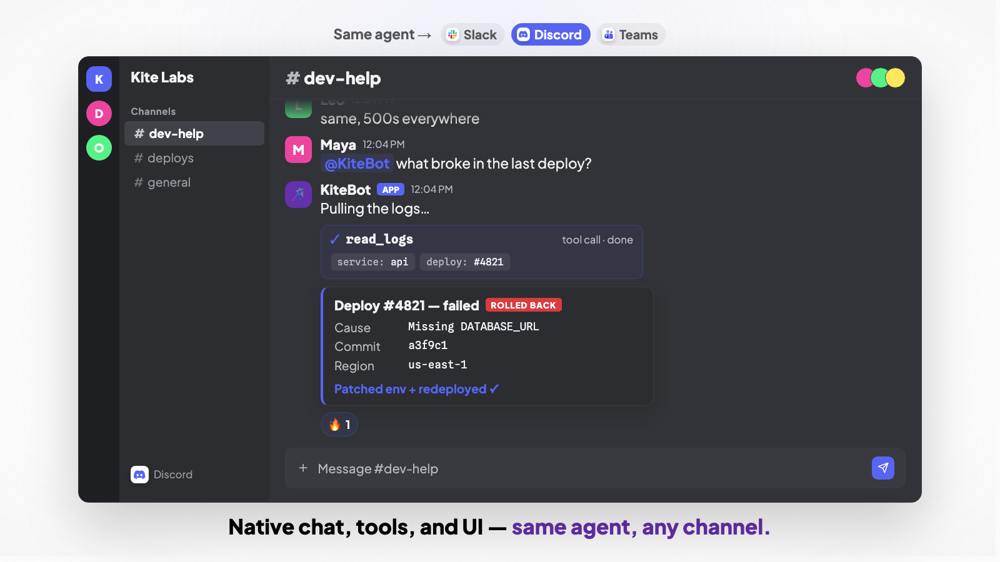
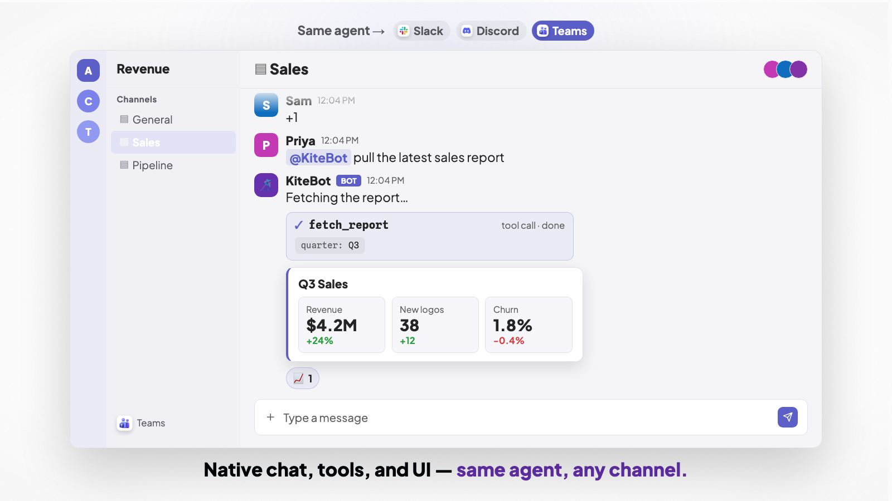
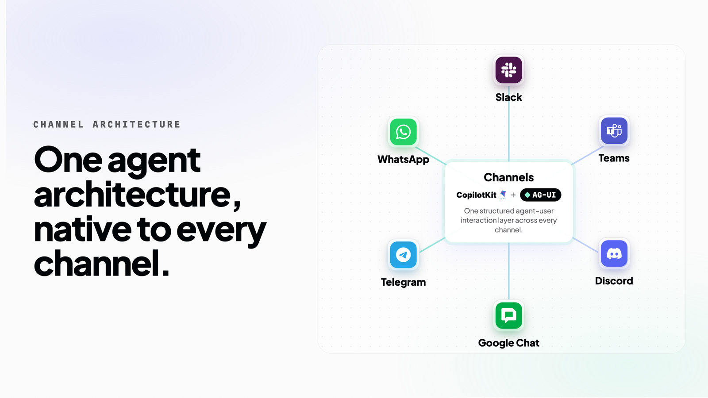

<div align="center">

# Channels SDK



**Build AI agents that live in Slack, Microsoft Teams, Discord, Telegram, and WhatsApp — with Google Chat, iMessage, and SMS on the way — write the agent once, and it renders native interactive UI on every platform.**

[](./LICENSE)
[](#status--roadmap)
[](https://www.npmjs.com/package/@copilotkit/channels)
[](https://github.com/ag-ui-protocol/ag-ui)
[](https://github.com/CopilotKit/OpenTag)

[Quick start](#quick-start) · [Concepts](#core-concepts) · [How it works](#how-it-works) · [Platforms](#supported-platforms) · [OpenTag](#see-it-in-production-opentag)

https://github.com/user-attachments/assets/98300c69-d4c5-4367-b6a1-a191426d7605

</div>

---

> **Channels SDK powers [OpenTag](https://github.com/CopilotKit/OpenTag)** — an open-source, self-hosted on-call triage assistant for Slack and Microsoft Teams. If you want to see the SDK driving a real, complete app rather than snippets, read OpenTag. [Jump to details ↓](#see-it-in-production-opentag)

## What is Channels SDK?

Channels SDK runs an AI agent inside a messaging platform. You write one Channel — handlers, tools, and JSX messages — and it runs on Slack, Teams, Discord, Telegram, and WhatsApp.

The agent doesn't just reply with text. It can render a button, ask you to pick an option, or show a chart and pause for your approval before it acts — as native UI on each platform. Doing that by hand means wiring an agent loop into every platform SDK: Block Kit for Slack, components for Discord, Adaptive Cards for Teams, plus your own plumbing for tool calls, streaming, human-in-the-loop, and state.

```ts
channel.onMessage(async ({ thread }) => {
  await thread.runAgent(); // replies, calls tools, renders buttons, pauses for input
});
```

## Same agent, every channel

The same Channel renders native, interactive UI on each platform — a real tool call and a real card, not a wall of text:

| Slack | Discord | Teams |
| --- | --- | --- |
|  |  |  |

## Quick start

Everything ships in one batteries-included package. `@copilotkit/channels` bundles the engine, the JSX vocabulary, and every platform adapter behind subpath exports.

```sh
npm i @copilotkit/channels
```

The runtime that owns the Channel lifecycle is a separate install — `npm i @copilotkit/runtime`. Upgrade the two together.

> **ESM only.** The package and all its subpaths are ESM-only — set `"type": "module"` and use `import`. `require()` is not supported. Node 22+ is required for managed delivery (it needs the global `WebSocket`).

Point the JSX factory at the package so `<Message>` / `<Button>` are statically type-checked:

```json title="tsconfig.json"
{
  "compilerOptions": {
    "target": "ES2022",
    "module": "NodeNext",
    "moduleResolution": "NodeNext",
    "strict": true,
    "jsx": "react-jsx",
    "jsxImportSource": "@copilotkit/channels"
  }
}
```

### 1. The agent

The agent is any AG-UI-compatible backend. Return a **fresh agent per thread** — never share one stateful instance across conversations:

```ts title="agent.ts"
import { BuiltInAgent } from "@copilotkit/runtime/v2";

export function makeAgent(threadId: string) {
  const agent = new BuiltInAgent({ model: "openai:gpt-5.4-mini" });
  agent.threadId = threadId;
  return agent;
}
```

Swap in `HttpAgent` from `@ag-ui/client` (LangGraph, CrewAI, Mastra, Pydantic AI, Google ADK, Claude Agent SDK, …) or `LangGraphHttpAgent` from `@copilotkit/runtime/langgraph` — the Channel code below doesn't change.

### 2. The Channel

```tsx title="channel.tsx"
import { createChannel, defineChannelTool } from "@copilotkit/channels";
import { Message, Header, Section, Markdown, Actions, Button } from "@copilotkit/channels/ui";
import { z } from "zod";
import { makeAgent } from "./agent.js";

export const channel = createChannel({
  // Must match the Channel code you created in the Intelligence dashboard.
  name: "deploy-bot",
  provider: "slack",
  agent: makeAgent,
  tools: [
    defineChannelTool({
      name: "deploy",
      description: "Trigger a deploy for the given environment.",
      parameters: z.object({ env: z.enum(["staging", "production"]) }),
      async handler({ env }, { thread }) {
        // Show an interactive confirmation before doing anything irreversible.
        await thread.post(
          <Message accent="#F59E0B">
            <Header>{`Confirm deploy: ${env}`}</Header>
            <Section>
              <Markdown>{`Ship to **${env}**?`}</Markdown>
            </Section>
            <Actions>
              <Button
                style="primary"
                onClick={async ({ thread }) => {
                  await thread.post(await deploy(env));
                }}
              >
                Ship it
              </Button>
              <Button
                style="danger"
                onClick={async ({ thread }) => {
                  await thread.post("Cancelled.");
                }}
              >
                Cancel
              </Button>
            </Actions>
          </Message>,
        );
        // This string is what the *model* reads back — tell it to stop and wait.
        return "Showed a deploy confirmation card. Waiting for the user to decide.";
      },
    }),
  ],
});

// Intelligence only delivers turns your agent should answer (a mention or a DM).
channel.onMessage(async ({ thread, message }) => {
  await thread.runAgent({
    // Combine text and attachments explicitly when the turn carries both.
    prompt: message.contentParts?.length
      ? [
          ...(message.text ? [{ type: "text" as const, text: message.text }] : []),
          ...message.contentParts,
        ]
      : message.text,
    context: [{ description: "Originating platform", value: message.platform }],
  });
});
```

### 3. Run it

The Channel is **runtime-driven** — there is no `channel.start()`. You declare it on a `CopilotRuntime` and the runtime owns its lifecycle:

```ts title="server.ts"
import { createServer } from "node:http";
import { CopilotRuntime, CopilotKitIntelligence } from "@copilotkit/runtime/v2";
import { createCopilotNodeListener } from "@copilotkit/runtime/v2/node";
import { channel } from "./channel.js";

const runtime = new CopilotRuntime({
  agents: {},
  intelligence: new CopilotKitIntelligence({
    apiKey: process.env.INTELLIGENCE_API_KEY!,
    // Hosted Intelligence supplies both by default. For a self-hosted deployment
    // override BOTH — the REST and realtime planes are separate hosts, so the ws
    // URL can't be derived from the API URL, and setting only one silently leaves
    // the other pointed at the managed host.
    apiUrl: process.env.INTELLIGENCE_API_URL,
    wsUrl: process.env.INTELLIGENCE_GATEWAY_WS_URL,
  }),
  identifyUser: () => ({ id: "channels-runtime", name: "Channels Runtime" }),
  channels: [channel],
});

const listener = createCopilotNodeListener({ runtime, basePath: "/api/copilotkit" });
const channels = listener.channels!;
const server = createServer(listener);

// `ready()` lazily opens the Realtime Gateway connection. It can resolve with
// setup still required, so check `status()` before declaring victory.
await channels.ready({ timeoutMs: 30_000 });
const status = channels.status();
if (status.overall !== "online") throw new Error(`Channel not online: ${JSON.stringify(status)}`);

server.listen(3000, () => console.log("Channel online"));

const shutdown = async () => {
  await channels.stop();
  if (server.listening) server.close();
};
process.once("SIGINT", shutdown);
process.once("SIGTERM", shutdown);
```

```dotenv title=".env"
INTELLIGENCE_API_KEY=cpk-…   # project-scoped key, from API Keys in the Intelligence sidebar
CHANNEL_CODE=deploy-bot      # must match the Channel code exactly
PORT=3000
```

```sh
node --env-file=.env --import tsx server.ts
```

Intelligence flips from **Waiting for runtime** to **Online**. Mention the app in Slack — it answers in the thread, can call `deploy`, and renders a real confirmation card. No Block Kit JSON, no interaction-payload parsing, no state store to wire up.

> **Keep the process alive.** Managed delivery holds a persistent gateway connection, so it needs a long-running Node host or container. A serverless request handler can't own it.

<details>
<summary><b>Troubleshooting</b></summary>

- **Stuck at "Waiting for runtime"** — `CHANNEL_CODE` doesn't match the Intelligence Channel code, `provider` is wrong, or the API key belongs to a different project.
- **Startup reports `setup_required`** — finish the platform credential steps in Intelligence. `ready()` settling does *not* mean the platform is online; that's why you check `status()`.
- **Online but never receives a mention** — invite the app to the channel, and confirm the `xoxb-…` and `xapp-…` tokens came from the *same* Slack app. Intelligence can't detect a valid-but-mismatched pair during setup.
- **The agent mixes conversations** — `makeAgent` must return a fresh agent per `threadId`, and assign that id where your framework requires it.
- **Channel sits in `connecting` forever on self-hosted** — a wrong `wsUrl` doesn't raise; it times out. Override `apiUrl` and `wsUrl` together, as bare base URLs with no `/api` or `/socket` path.

</details>

## Two ways to connect a platform

Every Channel runs through the CopilotKit runtime, so both paths need an Intelligence key. The difference is **who holds the platform credentials and owns the socket**.

| | Managed (Intelligence) | Direct adapter |
| --- | --- | --- |
| Declared as | `createChannel({ name, provider, agent })` | `createChannel({ name, adapters, agent })` |
| Platform tokens | Held by Intelligence — none in your app | You supply them to the adapter |
| Ingress / egress | Intelligence receives the event and does the credentialed send | Your process runs the socket or webhook |
| Delivery, retries, dedup, ordering | Managed | Yours |
| Files and media | Fetched, size-checked, handed to the agent as content parts | You fetch and cap them |
| Adding a platform | Attach it in the dashboard, no code change | Add another adapter |
| Providers | Slack, Microsoft Teams | Slack, Teams, Discord, Telegram, WhatsApp |

A direct adapter moves the platform connection into your process, but the runtime still owns the Channel lifecycle and still needs an Intelligence connection. Direct traffic does not traverse the managed gateway's delivery, retry, and durability layer — that reliability becomes yours. Don't mix the managed and direct paths on the same Channel.

```ts title="Direct Slack adapter"
import { createChannel } from "@copilotkit/channels";
import { slack, defaultSlackContext, defaultSlackTools } from "@copilotkit/channels/slack";

export const channel = createChannel({
  name: "support-direct",
  agent: makeAgent,
  tools: [...defaultSlackTools],
  context: [...defaultSlackContext],
  adapters: [
    slack({
      botToken: process.env.SLACK_BOT_TOKEN!, // xoxb-…
      appToken: process.env.SLACK_APP_TOKEN!, // xapp-…
      respondTo: {
        directMessages: true,
        appMentions: { reply: "thread" },
        threadReplies: "mentionsOnly",
      },
    }),
  ],
});
```

Wire it into the same `CopilotRuntime` block from step 3. For direct adapters, `provider` is ignored. One direct Channel may carry several adapters; its `name` must still be unique on that runtime.

## Core concepts

### 1. The Channel — routing

`createChannel()` returns a `Channel` you attach handlers to:

| Handler | Fires when… |
| --- | --- |
| `onMention(fn)` / `onMessage(fn)` | a turn comes in (mentions take priority over plain messages) |
| `onThreadStarted(fn)` | a conversation surface opens (e.g. Slack's assistant pane) — good for a greeting or suggested prompts |
| `onCommand(cmd)` / `onCommand(name, fn)` | a slash command is invoked |
| `onInteraction(id, fn)` | a bound action (button/select/input) is triggered |
| `onInterrupt(event, fn)` | the agent pauses mid-run and hands control back to you |
| `onReaction(fn)` / `onReaction(emoji, fn)` | a user adds or removes an emoji reaction |
| `onModalSubmit(callbackId, fn)` | a modal is submitted — return `{ errors }` to keep it open |
| `onModalClose(callbackId, fn)` | a modal is dismissed |

### 2. The Thread — the conversation handle

Every handler receives a `thread`. It's how you render and drive the conversation:

```ts
await thread.post(<Section>Working on it…</Section>);  // render JSX
await thread.update(ref, ui);                          // repaint in place
await thread.stream(tokenStream);                      // stream tokens live
await thread.runAgent({ prompt: message.text });        // run the agent loop
await thread.resume(value);                             // hand an answer back to a paused run
const value = await thread.awaitChoice(picker);         // block for a choice (direct adapters)
await thread.postEphemeral(user, ui, { fallbackToDM: true });
await thread.setState({ step: "awaiting_approval" });   // per-thread state
await thread.getMessages();                             // read conversation history
await thread.react(ref, "white_check_mark");
await thread.setTitle("Incident #4821");
await thread.setSuggestedPrompts([{ title: "Triage", message: "Triage this thread" }]);
await thread.postFile({ bytes, filename: "report.pdf" });
```

`post`/`update` render your JSX, mint content-stable handler IDs, and bind their events for you. `runAgent` drives the agent's run/tool/interrupt loop and renders each step as it streams. Capability-gated methods (`setTitle`, `react`, `getMessages`, `lookupUser`, …) return `{ ok: false }` or an empty result on surfaces that don't support them instead of throwing.

### 3. Tools — what the agent can do

Tools are plain functions with a typed parameter schema. They accept any [Standard Schema](https://standardschema.dev) validator (Zod, Valibot, ArkType), and their handler gets the live `thread` — so a tool can post UI, ask a question, or run a HITL flow while it executes:

```ts
defineChannelTool({
  name: "read_thread",
  description: "Read the messages in the current conversation.",
  parameters: z.object({}),
  async handler(_args, { thread }) {
    return await thread.getMessages();
  },
});
```

The return value is what the **agent** reads back, not the user. Return the raw data for a data tool (the SDK serializes it), the actual error text on failure, or a short natural-language confirmation for a tool that posted a card — don't hand-stringify, and don't return boilerplate like `{ ok: true }`.

Slash commands are defined the same way with `defineChannelCommand`, and get an optional `options` schema that maps to native typed arguments on surfaces that have them (Discord) while arriving as `ctx.text` on those that don't (Slack).

### 4. Interactive UI — JSX that renders everywhere

You describe messages as JSX. The same tree renders as Block Kit on Slack, components on Discord, and Adaptive Cards on Teams — and where a surface lacks a feature, that node degrades gracefully instead of erroring.

```tsx
<Message accent="#ff6600">
  <Header>Top story on Hacker News</Header>
  <Section>
    <Markdown>**{story.title}** — {story.points} points</Markdown>
  </Section>
  <Fields>
    <Field label="Author">{story.by}</Field>
    <Field label="Comments">{story.descendants}</Field>
  </Fields>
  <Actions>
    <Button url={story.url}>Open link</Button>
    <Button value={story.id} style="primary">Summarize thread</Button>
  </Actions>
</Message>
```

The vocabulary: `Message`, `Header`, `Section`, `Markdown`, `Fields`/`Field`, `Context`, `Divider`, `Image`, `Table`/`Row`/`Cell`, `Chart`, and the interactive `Actions`, `Button`, `Select`, and `Input`. Inline `onClick` / `onSelect` / `onSubmit` handlers are bound automatically, and `<Message onReaction>` catches reactions on a message you posted.

Modals get their own vocabulary — `Modal`, `TextInput`, `ModalSelect`, `ModalSelectOption`, `RadioButtons` — opened via `openModal(view)` from an interaction or command context, and routed back by `callbackId` to `onModalSubmit` / `onModalClose`. Modals are a direct-adapter feature; they are not available on managed Slack and Teams today.

### 5. Context — what the agent knows

`ContextEntry` values are `{ description, value }` pairs injected into the agent's prompt per run — the conversation's platform, the caller's role, whatever grounds the turn. Pass them on `createChannel({ context })` for every run, or on `thread.runAgent({ context })` for one. Each adapter also exports its own defaults (e.g. `defaultSlackContext`) with formatting and tagging guidance for that surface.

### 6. State — what survives a restart

`store` groups persistence, per-thread state, transcripts, and turn-lock tuning:

```ts
createChannel({
  name: "release-bot",
  agent: makeAgent,
  components: [ConfirmWrite],        // register components so clicks survive a restart
  store: {
    adapter: new MemoryStore(),      // swap for a durable StateStore (Redis, Postgres)
    state: z.object({ step: z.string() }),  // types thread.state()/setState() and validates writes
    identity: ({ author }) => author.email ?? null,   // cross-platform identity key
    transcripts: { retention: "30d", maxPerUser: 500 },
    onLockConflict: "drop",
  },
});
```

The `StateStore` contract covers `kv`, `list`, `lock`, `dedup`, and `queue` — one interface behind per-thread state, action snapshots, transcripts, turn locks, and inbound dedup. The default `MemoryStore` is in-process and lost on restart.

Because interactive handlers are keyed by **content-stable IDs** (a hash of the component's name, path, and props), a button clicked an hour after it was posted still resolves to the right handler. Register the component in `components` and configure a durable store and it resolves after a restart too; an unregistered inline handler degrades to "action expired".

`Transcripts` is a separate, cross-platform history store keyed by a resolved identity (e.g. email), so the same user's conversation carries across Slack and Teams. Set `store.identity` + `store.transcripts` and pass `thread.runAgent({ transcript: true })` to auto-bridge prior history into the run.

## Human-in-the-loop

Two shapes, depending on how the platform is connected.

**Post-and-resume** works everywhere, managed included. The tool posts a card and ends the agent's turn; the click resumes it:

```tsx
<Button
  style="primary"
  onClick={async ({ thread, message }) => {
    await thread.update(message.ref, <Message accent="#27AE60"><Header>Approved</Header></Message>);
    await thread.runAgent({ prompt: "The user approved. Go ahead." });
  }}
>
  Approve
</Button>
```

**Blocking** is available on direct adapters, where `thread.supportsBlockingChoice` is `true`. `awaitChoice` posts the picker and waits inline:

```ts
const { confirmed } = await thread.awaitChoice<{ confirmed: boolean }>(
  <ConfirmWrite action={action} />,
);
if (confirmed) await write();
```

A managed Channel delivers one turn at a time and does not block, so use post-and-resume there. When the agent pauses itself mid-run with an `on_interrupt` event, handle it with `channel.onInterrupt(name, fn)` and hand the answer back with `thread.resume(value)`.

## How it works

The core engine is platform-agnostic. Every surface is a **`PlatformAdapter`** — a small contract that translates between the platform's API and the engine's message IR:



```
  Slack / Teams / Discord / Telegram / WhatsApp / your own
        │  (CopilotKit Intelligence, or a direct PlatformAdapter)
        ▼
  ┌───────────────────────────────────────────┐
  │  Channels engine                          │
  │  routing · tools · agent loop · actions   │
  │  JSX → message IR · HITL · state store    │
  └───────────────────────────────────────────┘
        ▲
        │  agent (AG-UI run / tool / interrupt loop)
   your agent — @copilotkit/runtime, LangGraph, CrewAI, Mastra, custom, …
```

The agent it drives is any AG-UI-compatible backend. OpenTag runs a Python LangGraph agent over AG-UI and points the Channel at it — but a `BuiltInAgent` in the same process, CrewAI, Mastra, or a fully custom agent slots in the same way.

`CopilotRuntime` owns the Channel lifecycle in both connection models. Adding a new platform directly means implementing `PlatformAdapter` — receive turns, render `ChannelNode[]`, decode interactions — without touching any Channel logic.

## Supported platforms

Each platform is a subpath export of `@copilotkit/channels`.

| Platform | Import | Managed | Notes |
| --- | --- | --- | --- |
| **Slack** | `@copilotkit/channels/slack` | ✅ GA | Reference adapter — full interactive UI: buttons, selects, multi-select, modals, native streaming, assistant pane, ephemeral |
| **Microsoft Teams** | `@copilotkit/channels/teams` | ✅ | Adaptive Cards, field labels, multi-select (`isMultiSelect`); image-only outbound attachments |
| **Discord** | `@copilotkit/channels/discord` | Coming soon | Components V2, embeds, link buttons, native typed slash commands; text-only modals |
| **Telegram** | `@copilotkit/channels/telegram` | Direct only | Long-polling or webhook; degrades multi-select and link buttons; no modals |
| **WhatsApp** | `@copilotkit/channels/whatsapp` | Coming soon | Cloud API webhook; degrades to single-select where rich controls aren't expressible |
| **Google Chat** | — | Planned | Cards v2 rendering; adapter not published yet |
| **iMessage** | — | Planned | Adapter not published yet |
| **SMS** | — | Planned | Adapter not published yet |
| **Your own surface** | Bring an adapter | — | Implement `PlatformAdapter` — the engine and your Channel don't change |

Rows with an empty **Import** column have no subpath export in `0.4.0` yet — they are
on the roadmap, not installable today. Everything with an import path is shipping.

Feature-detection is built in: a `<Select multi>` renders as `multi_static_select` on Slack, max-values on Discord, `isMultiSelect` on Teams, and degrades to single-select on Telegram/WhatsApp. The renderer is total — a platform that can't render a node skips it rather than throwing. Emoji reactions are normalized to one canonical name across every adapter, with the platform-native token preserved on `rawEmoji`.

## Why not just use Bolt / discord.js directly?

Those SDKs are excellent *transports* — and Channels SDK adapters are built on top of them. The difference is everything above the transport:

| You still hand-write with a raw platform SDK | Channels SDK gives you |
| --- | --- |
| The agent run / tool-call / streaming loop | `thread.runAgent()` |
| Block Kit / components / Adaptive Cards, per platform | One JSX tree, rendered natively on each |
| Parsing interaction payloads and routing them | Inline `onClick` / `awaitChoice`, auto-bound |
| Human-in-the-loop pause/resume | `awaitChoice` / `onInterrupt` / `resume` |
| Conversation, action, and thread state across restarts | `StateStore` + registered `components` |
| Cross-platform history for the same person | `Transcripts` + `store.identity` |
| Platform credentials, retries, dedup, ordering | Managed delivery via Intelligence |
| Rewriting all of it for the next platform | Swap the adapter, or attach it in the dashboard |

The category this replaces isn't a library — it's the pile of glue between "an agent that could act" and "a chat surface that lets a human see and steer it."

## See it in production: OpenTag

[**OpenTag**](https://github.com/CopilotKit/OpenTag) is the flagship app built on Channels SDK — an open-source, self-hosted on-call triage assistant for Slack and Microsoft Teams, with research available on demand. It's the best reference for how the pieces in this README fit together in a complete app: generative UI, a LangGraph interrupt with a resumable confirmation card before any Linear or Notion write, tool execution, file-aware prompts, and graceful shutdown.

Its shape is exactly the one above: one `CopilotKitIntelligence`, one `CopilotRuntime`, and one adapter-free managed Channel, with a Python LangGraph agent over AG-UI as the backend.

```sh
pnpm install
cp .env.example .env    # OPENAI_API_KEY, AGENT_URL, INTELLIGENCE_API_KEY
pnpm dev                # Python agent (reload) + Node runtime (watch), concurrently
```

You create one managed Channel in the Intelligence dashboard and configure its Slack and Teams adapters there; no platform tokens live in the app. Read [OpenTag's README](https://github.com/CopilotKit/OpenTag) for the full platform setup — the Intelligence project, the Channel name, and the runtime API key.

## Packages

The umbrella package is the supported entry point. Its subpaths are the public API:

| Import | What it is |
| --- | --- |
| `@copilotkit/channels` | The platform-agnostic engine: `createChannel`, `Channel`, `Thread`, `defineChannelTool`, `defineChannelCommand`, `MemoryStore`, `Transcripts` (re-exports the UI vocabulary) |
| `@copilotkit/channels/ui` | The JSX vocabulary (`Message`, `Section`, `Button`, `Select`, `Chart`, `Modal`, …) |
| `@copilotkit/channels/slack` · `/teams` · `/discord` · `/telegram` · `/whatsapp` | One adapter per surface, plus its renderers, listener, stores, built-in tools and context, and limits |
| `@copilotkit/channels/intelligence` | The managed adapter (`intelligenceAdapter`) — normally wired for you by the runtime |
| `@copilotkit/channels/testing` | `FakeAdapter` / `FakeAgent` for testing Channels without a real platform |
| `@copilotkit/runtime` | The runtime that owns the Channel lifecycle, and `BuiltInAgent` if you want the agent in-process |

The individual `@copilotkit/channels-core`, `-ui`, and `-<platform>` packages are also published and versioned in lockstep, but prefer the umbrella package and its subpaths.

## Relationship to CopilotKit and AG-UI

Channels SDK is part of [CopilotKit](https://github.com/CopilotKit/CopilotKit), the open-source, MIT-licensed stack for agent-native applications, and the team behind the [AG-UI Protocol](https://github.com/ag-ui-protocol/ag-ui) — the open, event-based protocol for how agents talk to user-facing apps (adopted by Google, LangChain, AWS, Microsoft, Mastra, and PydanticAI).

CopilotKit's React hooks put agent-driven UI in your web app. Channels SDK puts the same pattern — agents that render real UI and pause for human input — into the messaging surfaces where teams already work. The agent loop it drives (runs, tool calls, interrupts) is the AG-UI model; any AG-UI-compatible agent slots in. **CopilotKit Intelligence** is the layer that holds platform credentials and owns managed delivery, plus thread persistence, durable state, and observability — self-hostable or in CopilotKit Cloud. The SDK stays fully open source either way.

## Status & roadmap

Channels SDK is in **preview** at `0.4.0`. APIs may still shift before a stable release; upgrade `@copilotkit/channels` and `@copilotkit/runtime` together.

- [x] Platform-agnostic engine — routing, tools, agent loop, action binding
- [x] JSX message vocabulary with cross-platform rendering, plus modals
- [x] Human-in-the-loop — post-and-resume everywhere, `awaitChoice` on direct adapters
- [x] Managed delivery via CopilotKit Intelligence — Slack GA, Microsoft Teams
- [x] Direct adapters for Slack, Teams, Discord, Telegram, WhatsApp
- [x] Pluggable `StateStore` — per-thread state, durable actions, locks, dedup
- [x] Cross-platform `Transcripts` keyed by identity
- [x] A complete reference app — [OpenTag](https://github.com/CopilotKit/OpenTag)
- [ ] Managed Discord and WhatsApp
- [ ] Google Chat, iMessage, and SMS adapters
- [ ] Durable `StateStore` recipes (Redis, Postgres)
- [ ] Proactive delivery to subscribed conversations
- [ ] Adapter authoring guide

## Contributing

Issues and PRs are welcome. If you're building an adapter for a platform we don't cover yet, open an issue first — we'd love to help and to link it here.

## License

[MIT](./LICENSE) © CopilotKit
